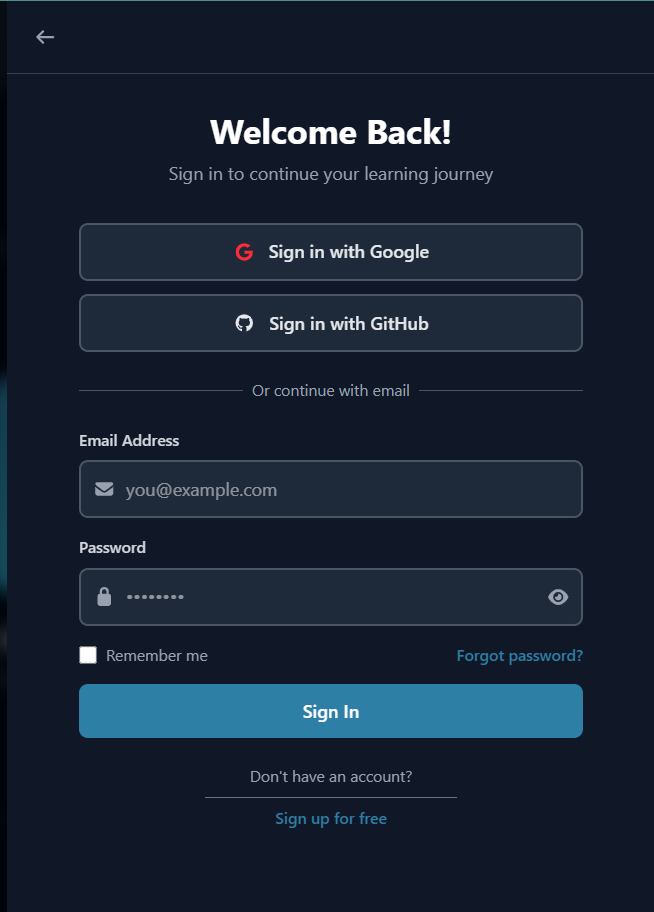
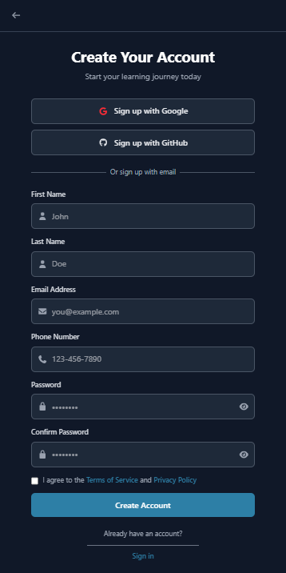
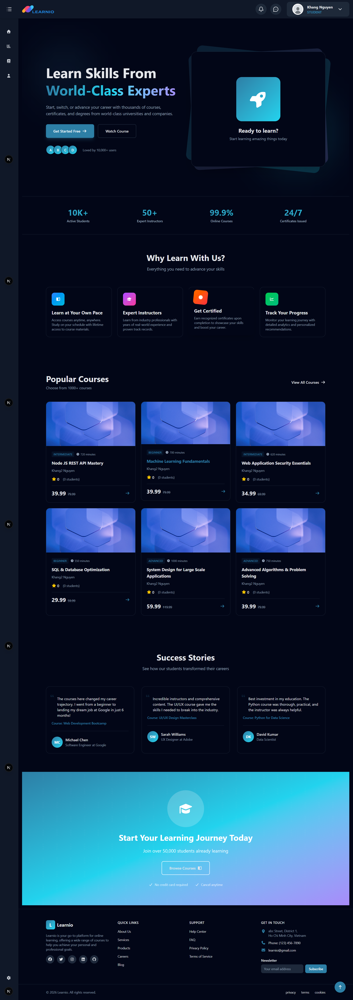
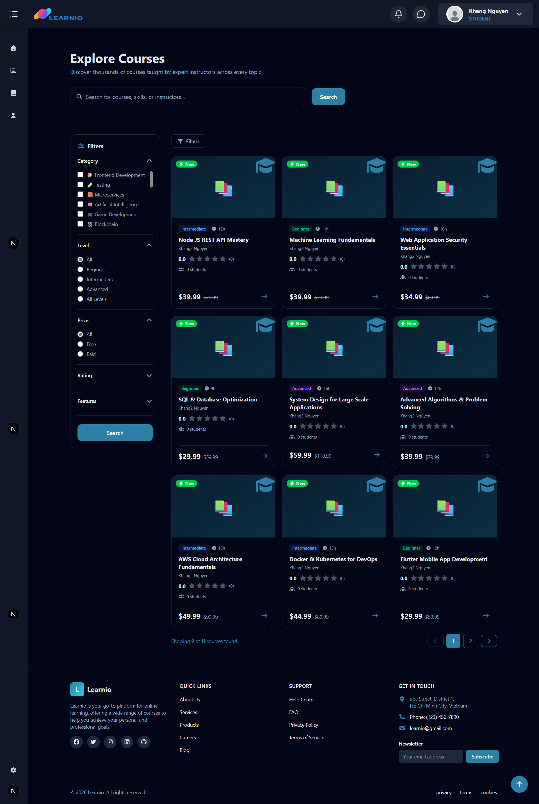
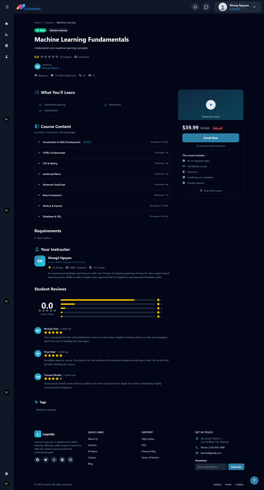
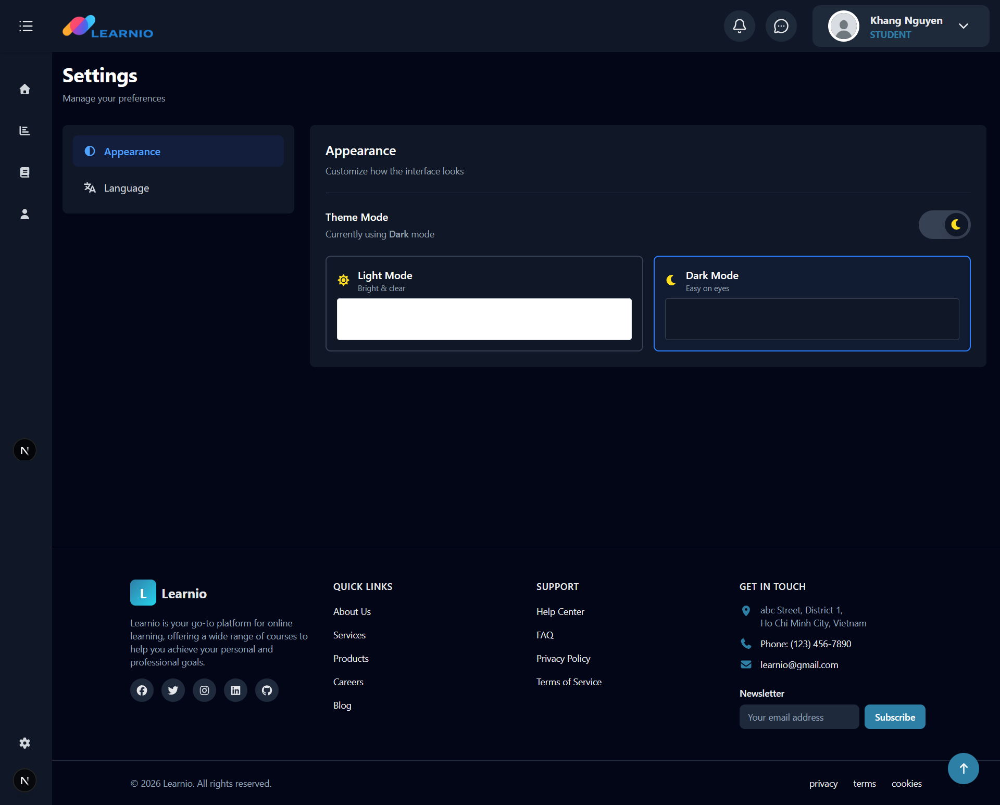
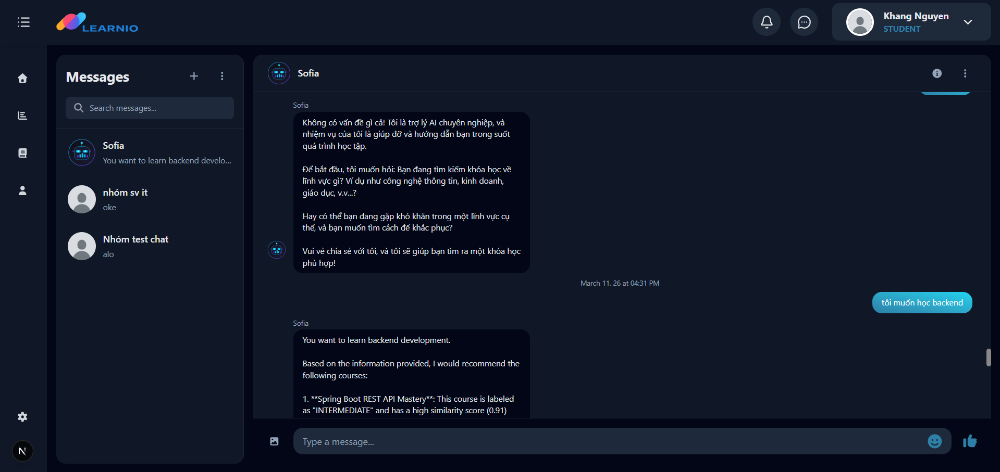

<div align="center">

# 🎓 Learnio — Frontend

**A modern learning management platform — learn, teach, and manage in a single unified system.**

[](https://nextjs.org/)
[](https://www.typescriptlang.org/)
[](https://tailwindcss.com/)
[](https://axios-http.com/)
[](https://developer.mozilla.org/en-US/docs/Web/API/WebSockets_API)

[🔗 Frontend Repo](https://github.com/nKhanGh/e-learning-fe) · [⚙️ Backend Repo](https://github.com/nKhanGh/e-learning-be)

</div>

---

## 📖 Introduction

**Learnio** is a comprehensive e-learning platform that supports the entire learning lifecycle — from discovering and enrolling in courses, watching interactive videos, completing assessments, to earning certificates.

Built with **Next.js (App Router)**, Learnio delivers a fast, smooth, and responsive experience across all devices.

---

## ⚡ Tech Stack

| Technology         | Role                                  |
| ------------------ | ------------------------------------- |
| ▲ **Next.js 15**   | Main framework (App Router, SSR/SSG)  |
| 🔷 **TypeScript**  | Programming language                  |
| 🎨 **TailwindCSS** | Styling & responsive design           |
| 📦 **Axios**       | HTTP client for backend communication |
| 🔌 **WebSocket**   | Real-time notifications & chat        |

---

## 📂 Project Structure

```id="fe_struct01"
src/
├── app/                     # App Router (Next.js 13+)
│   ├── [locale]/            # Internationalization routing
│   │   └── ...routes
│   ├── layout.tsx           # Root layout
│   └── page.tsx             # Entry page
├── components/
│   ├── layouts/             # Reusable layouts (Sidebar, Header, Footer, ...)
│   └── ui/                  # UI components (Button, Card, Modal, VideoPlayer, ...)
├── contexts/                # React Context (auth, cart, theme, ...)
├── i18n/                    # i18n configuration
├── messages/                # Localization files
├── services/                # API calls by domain
├── types/                   # TypeScript definitions
│   └── enums/               # Shared enums
└── utils/                   # Utility functions
```

---

## 🚀 Installation & Setup

### Requirements

* **Node.js** >= 18.x
* **npm** >= 9.x or **yarn** >= 1.22.x

---

### Setup Steps

### 1. Clone repository
```bash
git clone https://github.com/nKhanGh/e-learning-fe.git
cd e-learning-fe
```

### 2. Install dependencies
```bash
npm install
```

### 3. Create environment file
```bash
cp .env.example .env.local
```
### Fill in required environment variables
```bash
NEXT_PUBLIC_APP_API_URL='http://localhost:8080/api'
NEXT_PUBLIC_WS_API_URL='http://localhost:8080/api/ws'
NEXT_PUBLIC_AVATAR_BASE_URL='http://localhost:8080/api/files/avatars/'
```

### 4. Start development server
```bash
npm run dev
```

Application runs at: `http://localhost:3000`

---

### Other Scripts

```bash id="fe_scripts01"
npm run build        # Build for production
npm run start        # Start production server
npm run lint         # Run ESLint
npm run type-check   # TypeScript checking
```

---

## ✅ Features

### 🌐 Guest (Unauthenticated)

| Feature            | Description                                                                                  |
| ------------------ | -------------------------------------------------------------------------------------------- |
| 🔍 Search & Filter | Search courses by keyword, category, price, level, rating; multi-criteria sorting            |
| 📚 Course Browsing | View course list, details, curriculum, preview videos, and instructor info                   |
| ⭐ Reviews          | View ratings and reviews from other students                                                 |
| 🛒 Cart            | Add/remove courses, session-based cart (not started)                                         |
| 🔐 Authentication  | Register / Login via Email or OAuth2 (Google, Facebook); Forgot password; Email verification |

---

### 👤 Student

| Feature                 | Description                                                                                                |
| ----------------------- | ---------------------------------------------------------------------------------------------------------- |
| 👤 Profile              | View and update profile; change password                                                                   |
| 💳 Enrollment & Payment | Purchase courses via VNPay / Stripe / PayPal; apply coupons; request refunds (not started)                 |
| 🎬 Learning             | Feature-rich video player (speed, quality, subtitles); save progress; mark completion; notes (not started) |
| 📝 Assessment           | Take quizzes/assignments; view results and instructor feedback (not started)                               |
| 💬 Interaction          | Q&A forum, comments, messaging with instructors, real-time notifications (not started)                     |
| ⭐ Reviews               | Rate and review courses; edit/delete own reviews (not started)                                             |
| 🏆 Certificates         | Receive, download PDF, and share certificates (not started)                                                |
| 📊 Dashboard            | Track progress, learning streaks, recommendations, upcoming deadlines (not started)                        |
| 📱 Chat                 | Chat with users and AI-powered course assistant                                                            |

---

### 👨‍🏫 Instructor (not started)

| Feature                  | Description                                                                    |
| ------------------------ | ------------------------------------------------------------------------------ |
| 🏢 Profile               | Create instructor profile; verify credentials; link social accounts            |
| 📝 Course Management     | Create, edit, publish/unpublish, clone, archive courses                        |
| 🎬 Content Management    | Upload videos/materials; WYSIWYG editor; drip content; subtitles; free preview |
| 📋 Quiz & Assignment     | Create assessments; grading; deadlines; late submission support                |
| 👥 Student Management    | Track student progress; messaging; extend deadlines                            |
| 💬 Interaction           | Answer Q&A; announcements; host live sessions                                  |
| 🏷️ Pricing & Promotions | Set pricing; create coupons; join promotions                                   |
| 📊 Analytics             | Course performance dashboard; revenue reports; export Excel/CSV                |
| 💰 Earnings              | Track income; request payouts; download tax documents                          |
| 📱 Chat                  | Chat with users and AI assistant                                               |

---

### 🛡️ Admin & Moderator (not started)

| Feature              | Description                                               |
| -------------------- | --------------------------------------------------------- |
| 👥 User Management   | View, filter, suspend, ban, manage roles                  |
| 📚 Course Management | Approve/reject courses; feature courses; override pricing |
| 💰 Finance           | Revenue dashboard; refunds; payout approval               |
| 📢 Marketing         | Campaigns; newsletters; coupon management                 |
| 🔍 Moderation        | Handle reported content; review courses                   |
| ⚙️ System            | Platform settings; email templates; integrations          |
| 📊 Analytics         | System-wide metrics; growth; logs                         |
| 🔒 Audit             | Admin activity logs; GDPR compliance                      |

---

## 📸 Screenshots

Below are key features of the Learnio platform from the **student perspective**.

---

### 🔐 Authentication

<table align="center">
  <tr>
    <td align="center">
      <br/>
      <b>Login</b>
    </td>
    <td align="center">
      <br/>
      <b>Register</b>
    </td>
  </tr>
</table>

---

### 🏠 Home Page

<div align="center">
  
  <br/>
  <b>Main landing page with featured courses</b>
</div>

---

### 🔍 Course Search

<div align="center">
  
  <br/>
  <b>Search courses with filters and sorting</b>
</div>

---

### 📚 Course Detail

<div align="center">
  
  <br/>
  <b>Course overview, curriculum, and instructor information</b>
</div>

---

### ⚙️ Setting
<div align="center">
  
  <br/>
  <b>Setting with changing theme and language</b>
</div>

---
### 💬 Chat with other user and AI
<div align="center">
  
  <br/>
  <b>Chat with AI and other users</b>
</div>

---

<!-- ### 💳 Course Enrollment

<div align="center">
  
  <br/>
  <b>Enroll in a course and proceed to payment</b>
</div>

---

### 🎬 Learning Experience

<div align="center">
  
  <br/>
  <b>Interactive video player with progress tracking</b>
</div>

---

### 📝 Quiz / Assessment

<div align="center">
  
  <br/>
  <b>Take quizzes and view results</b>
</div>

---

### 📊 Learning Dashboard

<div align="center">
  
  <br/>
  <b>Track learning progres
</div> -->

---

## 🤝 Contribution

Pull requests are welcome! Please open an issue before making major changes.

---

<div align="center">

Made with 💙 by **Nguyen Huu Khang**

*Coding for fun, improving skills*

</div>
